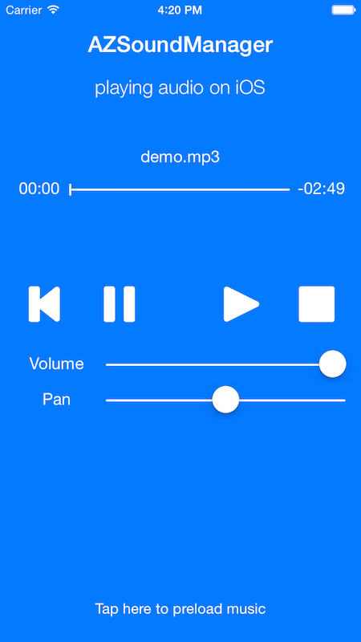

##Intro




AZSoundManager is a simple tool for playing sound and music in iOS apps.


##Installation

To use the AZSoundManager:

1. Just drag the class files into your project:

   * AZSoundManager.h
   * AZSoundManager.m
   * AZSoundItem.h
   * AZSoundItem.m

2. Add these frameworks:
   * AVFoundation.framework
   * MediaPlayer.framework

##Classes

The AZSoundManager package defines two classes: AZSoundManager and AZSoundItem.


###AZSoundItem properties

    @property (nonatomic, readonly) NSString *name;
    
The name of the item.
    
    @property (nonatomic, readonly) NSURL *URL;
    
The absolute URL of the sound file.

    @property (nonatomic, readonly) NSTimeInterval duration;
    
The duration (in seconds) of the sound file.

    @property (nonatomic, readonly) NSTimeInterval currentTime;
    
The current time offset (in seconds) of the sound file.
    
    @property (nonatomic, readonly) NSString *title;
    
The title from metadata of item.
    
    @property (nonatomic, readonly) NSString *album;
    
The album name from metadata of item.
    
    @property (nonatomic, readonly) NSString *artist;
    
The artist name from metadata of item.
    
    @property (nonatomic, readonly) UIImage *artwork;
    
The artwork image from metadata of item.


###AZSoundItem creation
    
    + (instancetype)soundItemWithContentsOfFile:(NSString*)path;
    - (instancetype)initWithContentsOfFile:(NSString*)path;
    + (instancetype)soundItemWithContentsOfURL:(NSURL*)URL;
    - (instancetype)initWithContentsOfURL:(NSURL*)URL;
    
These methods create a new AZSoundItem instance from a file path or URL.


###AZSoundManager properties

	@property (nonatomic, readonly) AZSoundStatus status;

The status of audio player.

	@property (nonatomic, readonly) AZSoundItem *currentItem;

The current item of audio player.

	@property (nonatomic, assign) float volume;

The sound volume. Should be in the range 0 - 1.

   	@property (nonatomic, assign) float pan;
    
The left/right stereo pan. Should be in the range from -1.0 to 1.0.

##Usage

###Playing a sound

```objc
NSString *filePath = [[NSBundle mainBundle] pathForResource:@"demo" ofType:@"mp3"];
AZSoundItem *item = [AZSoundItem soundItemWithContentsOfFile:filePath];

[[AZSoundManager sharedManager] playSoundItem:item];
```

###Preloading a sound

```objc
NSString *filePath = [[NSBundle mainBundle] pathForResource:@"demo" ofType:@"mp3"];
AZSoundItem *item = [AZSoundItem soundItemWithContentsOfFile:filePath];

[[AZSoundManager sharedManager] preloadSoundItem:item];
...
[[AZSoundManager sharedManager] play];
```

###Playing actions

```objc
- (void)play;
- (void)pause;
- (void)stop;
- (void)restart;
- (void)playAtSecond:(NSInteger)second;
- (void)rewindToSecond:(NSInteger)second;
```

###Get actual info about playing item

```objc
NSString *filePath = [[NSBundle mainBundle] pathForResource:@"demo" ofType:@"mp3"];
AZSoundItem *item = [AZSoundItem soundItemWithContentsOfFile:filePath];

[[AZSoundManager sharedManager] playSoundItem:item];

[[AZSoundManager sharedManager] getItemInfoWithProgressBlock:^(AZSoundItem *item) {
    NSLog(@"Item duration: %ld - current time: %ld", (long)item.duration, (long)item.currentTime);
} completionBlock:^{
    NSLog(@"finish playing");
}];
```

###Playing audio in background

In your plist just add value  
```
App plays audio or streams audio/video using AirPlay
```
for key
```
Required background modes
```

License
-------------
AZSoundManager is released under the MIT license. See LICENSE for details.
